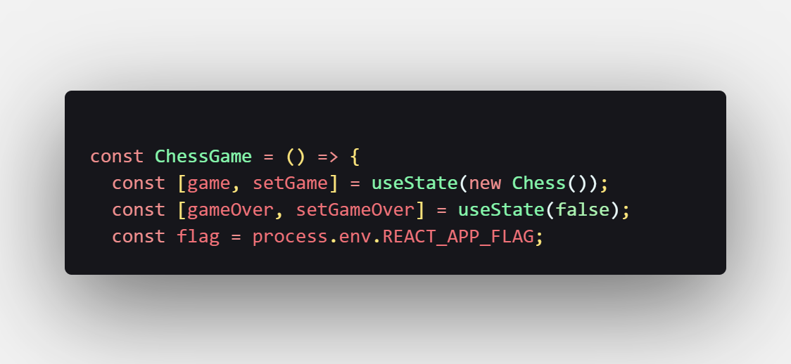
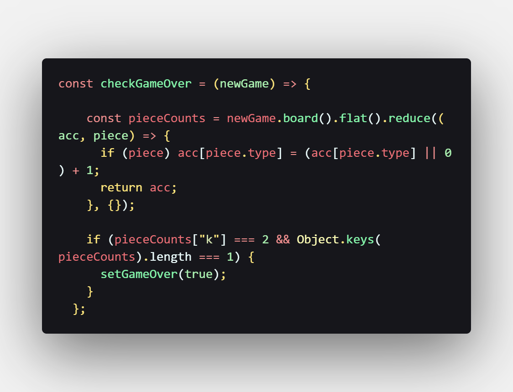
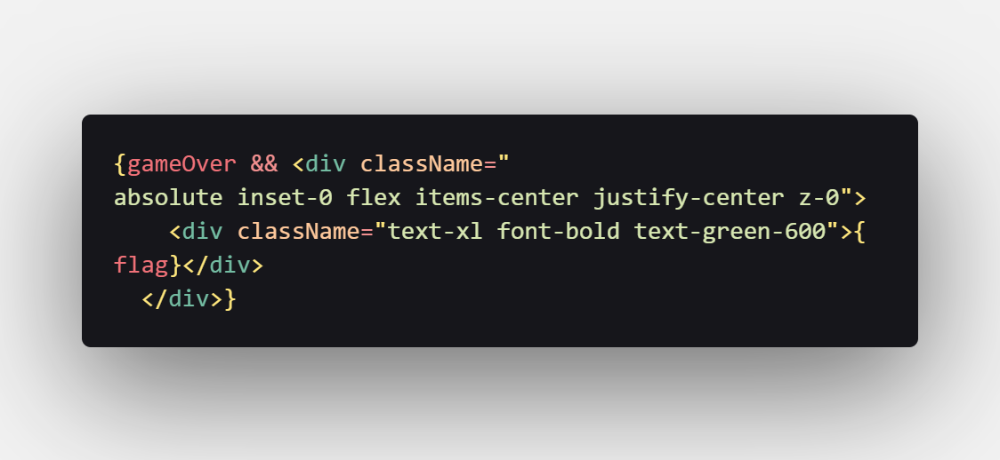

# Web Challenge Write-Up ***ChessGame***

This web challenge was built around a small chess game embedded in a web page. Let's walk through how we approached and solved it step by step.

---
### Step 1: Inspecting the Webpage

The first thing we did was open the developer tools using *Ctrl + Shift + I* (or *Cmd + Option + I* on Mac  ). In the **Sources** tab, we browsed through the file tree and spotted an interesting file called *ChessGame.jsx*.

---
### Step 2: Analyzing the Code

Once we opened *ChessGame.jsx*, we carefully read through the code to look for anything unusual or potentially flag-related.

---
### Step 3: Spotting the Flag Import

Scrolling through the code, we noticed something quite revealing: the flag was being imported directly at the top of the file.

That was a clear indicator that the flag could be revealed through the frontend logic somehow.

---
### Step 4: Understanding the ***gameOver*** Condition

We continued looking and found a function that handles the *gameOver* condition. This is where things got more interesting.

*if (pieceCounts["k"] === 2 && Object.keys(pieceCounts).length === 1) { setGameOver(true); }*

This tells us the game ends if **only two kings are left on the board** and **no other pieces remain**.

---
### Step 5: How the Flag Is Displayed

Once the *gameOver* state is triggered, the code has a conditional rendering that shows the flag.

---
### Step 6: Triggering the Condition In-Game

Now that we understood how the flag is revealed, we needed to play the game and **force a draw** (that is, end the game with only two kings left.)

Fortunately, the bot wasn't very strong (or maybe I'm just too good at chess 😎), so it wasn't hard to clear the board and meet the condition.

---
### Step 7: Read the flag

After playing the game and removing all pieces except the two kings, the *gameOver* condition was triggered, and the flag was displayed on the screen.

---
## ✅ Conclusion

This challenge was a great example of how fr    ont-end code can sometimes unintentionally reveal sensitive information like flags. Always remember to:

- Check JSX files.
    
- Look for imported resources.
    
- Analyze conditions that lead to state changes (*gameOver*, *showFlag*, etc.).
    
- Play around with the app logic if needed!

Rapido =)